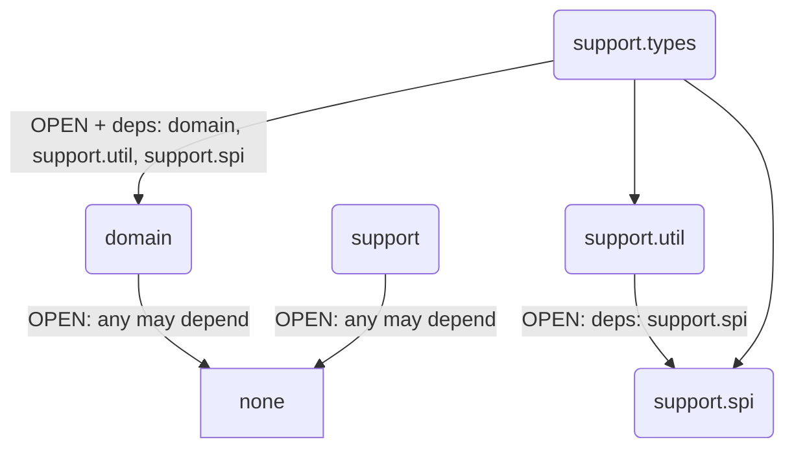

# Soda — DDD Scaffold

基于 yudao-cloud 业务功能改造的 DDD 脚手架项目。


## Module structure (Spring Modulith)

模块依赖通过 `@ApplicationModule(type = OPEN, allowedDependencies = …)` 严格白名单控制。
所有模块均设为 `type = OPEN`，允许被任何模块引用。无依赖的模块保持 `allowedDependencies = {}`，
有依赖的模块在 `allowedDependencies` 中显式声明。未声明的跨模块引用在测试阶段被拒绝。



| Module | Type | Package | Allowed dependencies |
|---|---|---|---|
|`domain`|`OPEN`|`com.soda.component.domain`|(none)|
|`support`|`OPEN`|`com.soda.component.support`|(none)|
|`support.util`|`OPEN`|`com.soda.component.support.util`|`support.spi`|
| `support.types` | `OPEN` | `com.soda.component.support.types` | `domain`, `support.util`, `support.spi` |
| `support.spi` | `OPEN` | `com.soda.component.support.spi` | (none) |
## Modulith 治理规则

### 白名单原则
模块依赖通过 `@ApplicationModule(type = OPEN, allowedDependencies = …)` 严格白名单控制。
所有模块均设为 `type = OPEN`（允许被任何模块引用）。
无依赖的模块（如 {@code domain}、{@code support}）设 {@code allowedDependencies = {}}。
有跨模块引用的模块（如 `support.types` 引用 `domain`、`support.util`）在 `allowedDependencies` 中显式声明。
未声明的跨模块引用在编译时不会被阻止，但会被 `ModulithTest` 在测试阶段捕获并拒绝。

| 模块角色 | `type` | `allowedDependencies` |
|---|---|---|
| 所有模块 | `OPEN` | `{}`（默认无依赖） |
| 有依赖的模块（如 support.types） | `OPEN` | `{"domain", …}` 显式声明白名单 |

### ModulithTest 强制
每个 Gradle 子项目（soda-components、soda-supports、将来每个 soda-xxx 业务模块）**必须**有一个 Modulith 一致性验证测试。

> 由于所有模块均为 `type = OPEN`，cycle check 在无依赖链时无类可验证。需在 `src/test/resources/archunit.properties` 中设置 `archRule.failOnEmptyShould=false`。

模板（放在项目的 `src/test/java/<base-package>/ModulithTest.java` 中）：

```java
import org.junit.jupiter.api.Test;
import org.springframework.modulith.core.ApplicationModules;

class ModulithTest {

    @Test
    void verifyModuleStructure() {
        ApplicationModules.of("com.soda.xxx").verify();
    }
}
```

模板（放在项目的 `src/test/resources/archunit.properties`）：

```properties
archRule.failOnEmptyShould=false
```

### 新增模块步骤
1. 在根包添加 `package-info.java`，标注 `@ApplicationModule(type = OPEN, allowedDependencies = {…})`，默认 `allowedDependencies = {}`
2. 在所属项目的 `ModulithTest` 注释表格中新增一行（文档用途，测试自动扫描）
3. 在 `allowedDependencies` 中声明所需模块的完整逻辑名（如 `support.util`，非 `util`）；有依赖时才需声明，默认留空
4. 确保项目 `src/test/resources/archunit.properties` 包含 `archRule.failOnEmptyShould=false`
5. 运行 `ModulithTest.verifyModuleStructure()` 确认无违反

## Language

### Domain Primitive（领域原语）
不可变的值对象，承载领域含义，通过类型系统表达业务约束。所有 DP 必须：不可变、自校验（构造时验证）、可序列化、可比较。参见 `Type` 接口。

### Entity
具有连续身份标识（identity thread）的领域对象。实现 {@link Identifiable} 接口，直接持有 {@link Identifier} DP 作为身份标识。三个构造器对应不同场景：{@code Entity(ID)}（手动 / 已有数据恢复）、{@code Entity(Supplier)}（客户端生成，构造器内部调用 generator）、{@code Entity()}（服务端生成，由 Repository 调用 {@code assignId()} 填补）。不覆写 {@code equals}/{@code hashCode}。

### Aggregate
聚合一致性边界内的顶层实体，负责保证聚合内部的所有不变量不被破坏。对聚合的所有操作必须通过聚合根进行。

### Identifiable
可标识的领域对象标记接口（{@code package domain.Identifiable}），提供 {@code getId()} 和 {@code isIdentified()} 查询契约。所有 Entity 和 Aggregate 必须实现此接口。

### Type
所有领域原语（Domain Primitive）的根标记接口。扩展 `Serializable` 和 `Comparable<Type>` — 所有 DP 都是值对象，需要可比。直接实现 Type 的类需提供 `compareTo(Type)`。

### Identifier
不可变的领域原语，扩展 `Type`，在限界上下文内唯一标识一个实体。底层值类型是泛型的（`Identifier<T extends Comparable<T>>`）。`compareTo(Type)` 已有默认实现委托给底层值比较，具体类无需覆写。实现类需提供 `identifier()` 返回类型化值，以及基于值的 `equals()`/`hashCode()`。

### LongId
通用的长整型标识符 DP（{@code support.types.LongId}），实现 {@code Identifier<Long>}，位于可选模块 {@code soda-component-support}。通过 {@code valueOf(Object)} 多格式解析构造，支持 Jackson 序列化。默认使用服务端生成策略（{@code super()} + {@code assignId()}）。

### UUId
UUID 格式标识符 DP（{@code support.types.UUId}），实现 {@code Identifier<String>}，位于可选模块 {@code soda-component-support}。校验规则：格式匹配 {@code 8-4-4-4-12} 十六进制，归一化为小写。提供 {@code valueOf(Object)} 多格式解析构造和 {@code random()} 随机生成，支持 Jackson 序列化。默认使用客户端生成策略（{@code super(UUId.AUTO)}）。

### Email
电子邮箱地址 DP（`com.soda.component.support.types.Email`），实现 {@link Type} 而非标识符。校验格式并归一化为小写。提供 `localPart()` 和 `domain()` 访问邮箱组成部分。

### WanYuan
人民币万元 DP（`com.soda.component.support.types.WanYuan`），实现 `Type` 而非标识符。内部以万元单位存储，精度到百元（最多两位小数）。提供 `valueOf(Object)` 以万元值构造、`fromYuan(BigDecimal)` 从元转换、`toYuan()` 转回元。

### Version
乐观锁版本号 DP（`com.soda.component.support.types.Version`），实现 `Type` 而非标识符。基于 `int`，带内部缓存（[0, 99] 返回缓存实例，参考 `Integer` 缓存设计）。提供 `of(int)` 可靠构造、`valueOf(Object)` 不可靠输入构造、`next()` 递增。初始版本 `PRIMARY = 0`。

### Cacheable
不是领域层概念，而是应用层（Application）的缓存关注点。通过 Spring `@Cacheable` 在 ApplicationService 上声明缓存区域和 key，领域层零缓存感知。不允许在 Entity / Aggregate 上添加与缓存相关的接口或基类方法。

### Lockable
不是领域层概念，而是应用层（Application）的锁定关注点。通过自定义 `@Lockable` 注解（参照 Spring `@Cacheable` 设计模式）声明锁资源 key，领域层零锁定感知。不允许在 Entity / Aggregate 上添加与锁相关的接口或基类方法。

### Trackable
不是领域层概念，而是基础设施层（Infrastructure / Repository）的持久化优化。Repository 实现层基于 snapshot/diff 做部分更新（参考 kk-ddd `AggregateTrackingManager`），Aggregate 本身无追踪逻辑。不允许在 Aggregate 上添加变更追踪接口或基类方法。

### KeyUtils
工具方法，位于 `com.soda.component.support.util`，用于从 Entity 推导缓存/锁资源 key。不在 Entity 基类上实现 `cacheKey()` / `lockKey()`，防止领域层膨胀。