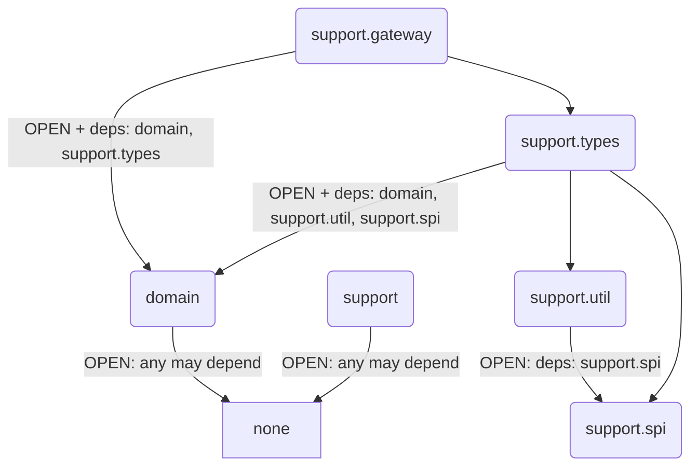

# Soda — DDD Scaffold

基于 yudao-cloud 业务功能改造的 DDD 脚手架项目。


## Module structure (Spring Modulith)

模块依赖通过 `@ApplicationModule(type = OPEN, allowedDependencies = …)` 严格白名单控制。
所有模块均设为 `type = OPEN`，允许被任何模块引用。无依赖的模块保持 `allowedDependencies = {}`，
有依赖的模块在 `allowedDependencies` 中显式声明。未声明的跨模块引用在测试阶段被拒绝。



| Module | Type | Package | Allowed dependencies |
|---|---|---|---|
|`domain`|`OPEN`|`com.soda.component.domain`|(none)|
|`support`|`OPEN`|`com.soda.component.support`|(none)|
|`support.spi`|`OPEN`|`com.soda.component.support.spi`|(none)|
|`support.util`|`OPEN`|`com.soda.component.support.util`|`support.spi`|
|`support.types`|`OPEN`|`com.soda.component.support.types`|`domain`, `support.util`, `support.spi`|
|`support.gateway`|`OPEN`|`com.soda.component.support.gateway`|`domain`, `support.types`|
## Modulith 治理规则

### 白名单原则
模块依赖通过 `@ApplicationModule(type = OPEN, allowedDependencies = …)` 严格白名单控制。
所有模块均设为 `type = OPEN`（允许被任何模块引用）。
无依赖的模块（如 {@code domain}、{@code support}）设 {@code allowedDependencies = {}}。
有跨模块引用的模块（如 `support.types` 引用 `domain`、`support.util`）在 `allowedDependencies` 中显式声明。
未声明的跨模块引用在编译时不会被阻止，但会被 `ModulithTest` 在测试阶段捕获并拒绝。

| 模块角色 | `type` | `allowedDependencies` |
|---|---|---|
| 所有模块 | `OPEN` | `{}`（默认无依赖） |
| 有依赖的模块（如 support.types） | `OPEN` | `{"domain", …}` 显式声明白名单 |

### ModulithTest 强制
每个 Gradle 子项目（soda-components、soda-supports、将来每个 soda-xxx 业务模块）**必须**有一个 Modulith 一致性验证测试。

> 由于所有模块均为 `type = OPEN`，cycle check 在无依赖链时无类可验证。需在 `src/test/resources/archunit.properties` 中设置 `archRule.failOnEmptyShould=false`。

模板（放在项目的 `src/test/java/<base-package>/ModulithTest.java` 中）：

```java
import org.junit.jupiter.api.Test;
import org.springframework.modulith.core.ApplicationModules;

class ModulithTest {

    @Test
    void verifyModuleStructure() {
        ApplicationModules.of("com.soda.xxx").verify();
    }
}
```

模板（放在项目的 `src/test/resources/archunit.properties`）：

```properties
archRule.failOnEmptyShould=false
```

### 新增模块步骤
1. 在根包添加 `package-info.java`，标注 `@ApplicationModule(type = OPEN, allowedDependencies = {…})`，默认 `allowedDependencies = {}`
2. 在所属项目的 `ModulithTest` 注释表格中新增一行（文档用途，测试自动扫描）
3. 在 `allowedDependencies` 中声明所需模块的完整逻辑名（如 `support.util`，非 `util`）；有依赖时才需声明，默认留空
4. 确保项目 `src/test/resources/archunit.properties` 包含 `archRule.failOnEmptyShould=false`
5. 运行 `ModulithTest.verifyModuleStructure()` 确认无违反

## Language

### Domain Primitive（领域原语）
不可变的值对象，承载领域含义，通过类型系统表达业务约束。所有 DP 必须：不可变、自校验（构造时验证）、可序列化、可比较。参见 `Type` 接口。

### Entity
具有连续身份标识（identity thread）的领域对象。实现 {@link Identifiable}、{@link EventSource} 接口，直接持有 {@link Identifier} DP 作为身份标识。三个构造器对应不同场景：{@code Entity(ID)}（手动 / 已有数据恢复）、{@code Entity(Supplier)}（客户端生成，构造器内部调用 generator）、{@code Entity()}（服务端生成，由上层调用 {@code assignId()} 填补）。不覆写 {@code equals}/{@code hashCode}。

### Aggregate
聚合一致性边界内的顶层实体，负责保证聚合内部的所有不变量不被破坏。对聚合的所有操作必须通过聚合根进行。

### Identifiable
可标识的领域对象标记接口（{@code package domain.Identifiable}），提供 {@code getId()} 和 {@code isIdentified()} 查询契约。所有 Entity 和 Aggregate 必须实现此接口。

### Type
所有领域原语（Domain Primitive）的根标记接口。扩展 `Serializable` — 类型安全的可比较性由子类各自实现 `Comparable<Self>` 保证。直接实现 Type 的类需提供 `compareTo(Self)`.

### EnumType
枚举类型的根标记接口（{@code com.soda.component.domain.EnumType}），继承 {@link Type}，同时也是 Domain Primitive。提供 {@code desc()} 返回英文描述。业务模块中所有业务枚举必须实现此接口。序列化使用枚举自带 {@code name()} 短名（如 {@code "E"}），各枚举额外提供 {@code of(String)}（{@code @JsonCreator} 入口）。

### Identifier
不可变的领域原语，扩展 `Type`，在限界上下文内唯一标识一个实体。底层值类型是泛型的（`Identifier<T extends Comparable<T>>`）。子类自行实现 `Comparable<Self>` 提供类型安全的比较。实现类需提供 `identifier()` 返回类型化值，以及基于值的 `equals()`/`hashCode()`。

### LongId
通用的长整型标识符 DP（{@code support.types.LongId}），实现 {@code Identifier<Long>}，位于可选模块 {@code soda-component-support}。通过 {@code valueOf(Object)} 多格式解析构造，支持 Jackson 序列化。默认使用服务端生成策略（{@code super()} + {@code assignId()}）。

### UUId
UUID 格式标识符 DP（{@code support.types.UUId}），实现 {@code Identifier<String>}，位于可选模块 {@code soda-component-support}。校验规则：格式匹配 {@code 8-4-4-4-12} 十六进制，归一化为小写。提供 {@code valueOf(Object)} 多格式解析构造和 {@code random()} 随机生成，支持 Jackson 序列化。默认使用客户端生成策略（{@code super(UUId.AUTO)}）。

### Email
电子邮箱地址 DP（`com.soda.component.support.types.Email`），实现 {@link Type} 而非标识符。校验格式并归一化为小写。提供 `localPart()` 和 `domain()` 访问邮箱组成部分。

### WanYuan
人民币万元 DP（`com.soda.component.support.types.WanYuan`），实现 `Type` 而非标识符。内部以万元单位存储，精度到百元（最多两位小数）。提供 `valueOf(Object)` 以万元值构造、`fromYuan(BigDecimal)` 从元转换、`toYuan()` 转回元。

### Version
乐观锁版本号 DP（`com.soda.component.support.types.Version`），实现 `Type` 而非标识符。基于 `int`，带内部缓存（[0, 99] 返回缓存实例，参考 `Integer` 缓存设计）。提供 `of(int)` 可靠构造、`valueOf(Object)` 不可靠输入构造、`next()` 递增。初始版本 `PRIMARY = 0`。
### SmsContent
短信内容 DP（{@code support.types.SmsContent}），实现 {@link Type}。最长 70 字符（参照主流短信平台单条上限）。
### EmailContent
邮件内容 DP（{@code support.types.EmailContent}），实现 {@link Type}。由 {@code subject}（最长 255 字符）和 {@code body} 组成。
### CodeLength
验证码长度 DP（{@code support.types.CodeLength}），实现 {@link Type}。取值范围 [1, 100]。
### CodeValue
验证码值 DP（{@code support.types.CodeValue}），实现 {@link Type}。仅限字母数字。
### RawPassword
原始密码 DP（{@code support.types.RawPassword}），实现 {@link Type}。非 blank，不校验格式（密码策略在上层决定）。
### PasswordHash
密码哈希 DP（{@code support.types.PasswordHash}），实现 {@link Type}。校验 BCrypt 哈希格式。

### Cacheable
不是领域层概念，而是应用层（Application）的缓存关注点。通过 Spring `@Cacheable` 在 ApplicationService 上声明缓存区域和 key，领域层零缓存感知。不允许在 Entity / Aggregate 上添加与缓存相关的接口或基类方法。

### Lockable
不是领域层概念，而是应用层（Application）的锁定关注点。通过自定义 `@Lockable` 注解（参照 Spring `@Cacheable` 设计模式）声明锁资源 key，领域层零锁定感知。不允许在 Entity / Aggregate 上添加与锁相关的接口或基类方法。

### Trackable
不是领域层概念，而是基础设施层（Infrastructure / Repository）的持久化优化。Repository 实现层基于 snapshot/diff 做部分更新（参考 kk-ddd `AggregateTrackingManager`），Aggregate 本身无追踪逻辑。不允许在 Aggregate 上添加变更追踪接口或基类方法。

### KeyUtils
工具方法，位于 `com.soda.component.support.util`，用于从 Entity 推导缓存/锁资源 key。不在 Entity 基类上实现 `cacheKey()` / `lockKey()`，防止领域层膨胀。

### Gateway
标记接口，无方法无泛型。供 IOC 容器扫描和 AOP 切面识别。所有 Gateway 接口的根。

### EntityGateway
实体持久化契约，继承 `Gateway`。泛型 `<T extends Entity<ID>, ID extends Identifier<?>>`。
提供 `save(T)`, `remove(T)`, `findById(ID)`, `findAllById(Iterable<ID>)` 四个方法。
`save` 返回 `ID`（可能新生成），`remove` 接收实体。ApplicationService 先通过 Gateway 持久化，再调用 {@link EventSource#flushEvents} 取出事件并通过 {@link DomainEventBus#fireAll} 发送。

### PasswordEncoder (Gateway)
密码编码器契约（{@code support.gateway.PasswordEncoder}），继承 {@link Gateway}。提供 {@code encode(RawPassword)} → {@link PasswordHash} 和 {@code matches(RawPassword, PasswordHash)}。实现层对接 Spring Security 的 BCryptPasswordEncoder。
### CodeGenerator (Gateway)
验证码/令牌生成器契约（{@code support.gateway.CodeGenerator}），继承 {@link Gateway}。提供 {@code generate(CodeLength)} → {@link CodeValue}。实现层提供具体的生成算法。
### SmsSender (Gateway)
短信发送器契约（{@code support.gateway.SmsSender}），继承 {@link Gateway}。提供 {@code send(Mobile, SmsContent)}。实现层对接短信渠道（阿里云、腾讯云等）。
### EmailSender (Gateway)
邮件发送器契约（{@code support.gateway.EmailSender}），继承 {@link Gateway}。提供 {@code send(Email, EmailContent)}。实现层对接邮件服务器或邮件 SDK。

### DomainEvent
领域事件基接口，泛型 `<ID extends Identifier<?>>`。提供 `entityId()` 和 `occurredAt()` 两个方法。业务模块用 `record` 实现，`entityId` 和 `occurredAt` 作为 record 组件自动实现接口方法。
类型参数 `ID` 与 Entity 一致，编译期确保事件来源不混用。

### DomainEventBus
领域事件总线接口，继承 `Gateway`（DIP：领域层定义契约，基础设施层实现）。
提供 `fire(DomainEvent<?>)` 和 `fireAll(Iterable<? extends DomainEvent<?>>)`。
实现在基础设施层，对接 Spring ApplicationEventPublisher、Modulith 事件总线或 MQ。

### EventSource
领域事件来源标记接口，泛型 `<ID extends Identifier<?>>`。{@link Entity} 实现此接口表明自身可作为领域事件来源。通过 {@link #flushEvents} 取出已注册但未发送的事件。ApplicationService 在 {@link EntityGateway} 持久化后调用此方法取出事件，再通过 {@link DomainEventBus#fireAll} 发送。


### VerificationCodePolicy
验证码策略 DP（{@code soda-user.domain.VerificationCodePolicy}），实现 {@link Type}。封装 {@code codeLength}（验证码位数）和 {@code expiry}（过期时长）。各 AuthAccount 子类持有静态 {@code DEFAULT_POLICY} 常量，可通过 {@link ServiceLoader} 机制全局替换。AuthAccount 实例上也可设置非空 {@code verificationCodePolicy} 字段覆写。

### User
用户身份聚合根（{@code soda-user.domain.User}），{@link Aggregate} 子类。持有一组 {@link AuthAccount} 子实体。提供 {@code authenticate(AuthAccountType, credential)} 域方法，委托给对应 AuthAccount 验证。

### Username
用户账号 DP（{@code soda-user.domain.Username}），实现 {@link Type}。规则：4-30 位字母数字。可通过 {@code User.changeUsername()} 变更，变更时需保证全局唯一。

### Nickname
用户昵称 DP（{@code soda-user.domain.Nickname}），实现 {@link Type}。显示名，最长 30 字符。

### Mobile
手机号 DP（{@code support.types.Mobile}），实现 {@link Type}。格式校验，归一化。同时是 {@link SmsAuthAccountId} 的派生源。

### Sex
性别枚举（{@code soda-user.domain.enums.Sex}），实现 {@link EnumType}（同时也是 DP）。取值：{@code M}（Male）、{@code F}（Female）。序列化短名 {@code "M"} / {@code "F"}。提供 {@code of(String)} 和 {@code valueOf(Object)} 工厂方法。

### Avatar
头像 URL DP（{@code soda-user.domain.Avatar}），实现 {@link Type}。URL 格式校验。

### UserStatus
用户状态枚举（{@code soda-user.domain.enums.UserStatus}），实现 {@link EnumType}（同时也是 DP）。取值：{@code E}（Enabled）、{@code D}（Disabled）。序列化短名 {@code "E"} / {@code "D"}。提供 {@code of(String)} 和 {@code valueOf(Object)} 工厂方法。

### SocialType
社交平台类型枚举（{@code soda-user.domain.enums.SocialType}），实现 {@link EnumType}（同时也是 DP）。取值：{@code GE}（Gitee）、{@code DT}（DingTalk）、{@code WENT}（WechatWork）、{@code WMP}（WechatMp）、{@code WOPN}（WechatOpen）、{@code WMIN}（WechatMini）、{@code ALIP}（AlipayMini）。序列化短名。提供 {@code of(String)} 和 {@code valueOf(Object)} 工厂方法。

### AuthAccount
用户认证账号实体（{@code soda-user.domain.AuthAccount}），{@link Entity} 密封子类，每个子类对应一种认证方式。作为 {@link User} 聚合的子实体，由聚合根管理生命周期。{@code accountId} 使用 {@link AuthAccountId} 密封基类，序列化为包含 {@link AuthAccountType} 短名前缀的字符串（例：{@code "S:13800138000"}）。
构造器手动传入 ID（与 User 的服务端生成不同），通过 {@code active} 参数指定激活状态。
验证码通过 {@code replaceCode(VerificationCode)} 注入，由 ApplicationService 在外部生成验证码并调用发送器 Gateway 发送。验证码策略（长度、过期时间）由 {@link VerificationCodePolicy} DP 表达，构造时可选传入，各子类持有静态默认值。
提供静态 Predicate 常量 {@code ACTIVE} 和工厂方法 {@code ofType(AuthAccountType)}，可与 {@code findAccount(Predicate)} 组合使用。

### PasswordAuthAccount
密码认证账号（{@code soda-user.domain.PasswordAuthAccount}），{@link AuthAccount} 子类。{@code accountId = PasswordAuthAccountId.from(UserId)}。持有一个不可变的 {@code passwordHash}（BCrypt）。提供 {@code verify()} 和 {@code changePassword()} 业务方法。

### SmsAuthAccount
短信认证账号（{@code soda-user.domain.SmsAuthAccount}），{@link AuthAccount} 子类。{@code accountId = SmsAuthAccountId.from(Mobile)}。持有一个可选的 {@link VerificationCode} DP，通过 {@code replaceCode(VerificationCode)} 注入。提供 {@code verifyCode()}、{@code useCode()}、{@code getPolicy()} 方法。

### EmailAuthAccount
邮箱认证账号（{@code soda-user.domain.EmailAuthAccount}），{@link AuthAccount} 子类。{@code accountId = EmailAuthAccountId.from(Email)}。持有一个可选的 {@link VerificationCode} DP，通过 {@code replaceCode(VerificationCode)} 注入。提供 {@code verifyCode()}、{@code useCode()}、{@code getPolicy()} 方法。

### SocialAuthAccount
社交认证账号（{@code soda-user.domain.SocialAuthAccount}），{@link AuthAccount} 子类。{@code accountId = SocialAuthAccountId.from(SocialType, openId)}。纯标识映射，无密码验证。

### AuthAccountId
账户标识符密封基类（{@code soda-user.domain.AuthAccountId}），实现 {@link Identifier}{@code <String>}。所有 AuthAccount 子类的标识符统一为此类型。序列化格式：{@code "{AuthAccountType短名}:{业务键}"}。四个子类：

| 子类 | 格式示例 | 持有属性 |
|---|---|---|
| {@link PasswordAuthAccountId} | {@code "P:42"} | {@link UserId} |
| {@link SmsAuthAccountId} | {@code "S:13800138000"} | {@link Mobile} |
| {@link EmailAuthAccountId} | {@code "E:user@example.com"} | {@link Email} |
| {@link SocialAuthAccountId} | {@code "O:GE:open123"} | {@link SocialType} + {@code openId} |

反序列化通过各子类的 {@code valueOf(Object)} 完成，Jackson 需声明具体子类类型。
认证方式枚举（{@code soda-user.domain.enums.AuthAccountType}），实现 {@link EnumType}（同时也是 DP）。取值：{@code P}（Password）、{@code S}（Sms）、{@code E}（Email）、{@code O}（OAuth）。序列化短名。提供 {@code of(String)} 和 {@code valueOf(Object)} 工厂方法。


### VerificationCode
验证码 DP（{@code soda-user.domain.VerificationCode}），实现 {@link Type}。封装验证码值、过期时间、是否已使用。提供 {@code expired()}、{@code used()}、{@code verify(code)}、{@code use()} 等业务方法。
