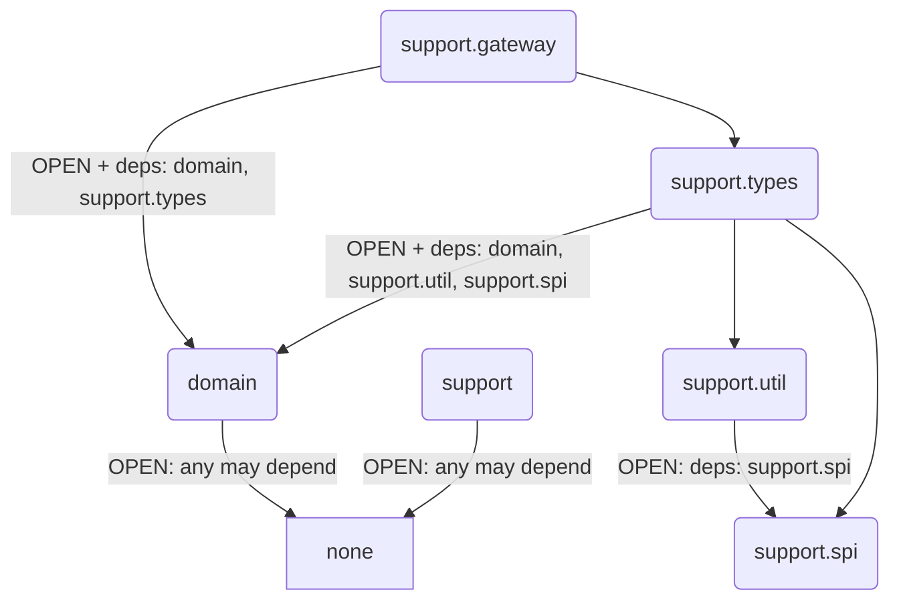

# Soda — DDD Scaffold

基于 yudao-cloud 业务功能改造的 DDD 脚手架项目。


## Module structure (Spring Modulith)

模块依赖通过 `@ApplicationModule(type = OPEN, allowedDependencies = …)` 严格白名单控制。
所有模块均设为 `type = OPEN`，允许被任何模块引用。无依赖的模块保持 `allowedDependencies = {}`，
有依赖的模块在 `allowedDependencies` 中显式声明。未声明的跨模块引用在测试阶段被拒绝。



| Module | Type | Package | Allowed dependencies |
|---|---|---|---|
|`domain`|`OPEN`|`com.soda.component.domain`|(none)|
|`support`|`OPEN`|`com.soda.component.support`|(none)|
|`support.spi`|`OPEN`|`com.soda.component.support.spi`|(none)|
|`support.util`|`OPEN`|`com.soda.component.support.util`|`support.spi`|
|`support.types`|`OPEN`|`com.soda.component.support.types`|`domain`, `support.util`, `support.spi`|
|`support.gateway`|`OPEN`|`com.soda.component.support.gateway`|`domain`, `support.types`|
## Modulith 治理规则

### 白名单原则
模块依赖通过 `@ApplicationModule(type = OPEN, allowedDependencies = …)` 严格白名单控制。
所有模块均设为 `type = OPEN`（允许被任何模块引用）。
无依赖的模块（如 {@code domain}、{@code support}）设 {@code allowedDependencies = {}}。
有跨模块引用的模块（如 `support.types` 引用 `domain`、`support.util`）在 `allowedDependencies` 中显式声明。
未声明的跨模块引用在编译时不会被阻止，但会被 `ModulithTest` 在测试阶段捕获并拒绝。

| 模块角色 | `type` | `allowedDependencies` |
|---|---|---|
| 所有模块 | `OPEN` | `{}`（默认无依赖） |
| 有依赖的模块（如 support.types） | `OPEN` | `{"domain", …}` 显式声明白名单 |

### ModulithTest 强制
每个 Gradle 子项目（soda-components、soda-supports、将来每个 soda-xxx 业务模块）**必须**有一个 Modulith 一致性验证测试。

> 由于所有模块均为 `type = OPEN`，cycle check 在无依赖链时无类可验证。需在 `src/test/resources/archunit.properties` 中设置 `archRule.failOnEmptyShould=false`。

模板（放在项目的 `src/test/java/<base-package>/ModulithTest.java` 中）：

```java
import org.junit.jupiter.api.Test;
import org.springframework.modulith.core.ApplicationModules;

class ModulithTest {

    @Test
    void verifyModuleStructure() {
        ApplicationModules.of("com.soda.xxx").verify();
    }
}
```

模板（放在项目的 `src/test/resources/archunit.properties`）：

```properties
archRule.failOnEmptyShould=false
```

### 新增模块步骤
1. 在根包添加 `package-info.java`，标注 `@ApplicationModule(type = OPEN, allowedDependencies = {…})`，默认 `allowedDependencies = {}`
2. 在所属项目的 `ModulithTest` 注释表格中新增一行（文档用途，测试自动扫描）
3. 在 `allowedDependencies` 中声明所需模块的完整逻辑名（如 `support.util`，非 `util`）；有依赖时才需声明，默认留空
4. 确保项目 `src/test/resources/archunit.properties` 包含 `archRule.failOnEmptyShould=false`
5. 运行 `ModulithTest.verifyModuleStructure()` 确认无违反

## Language

### User
用户身份聚合根。持有一组 AuthAccount 子实体。提供 `authenticate(AuthAccountType, String, CredentialHasher)` 域方法，sealed 模式匹配分发到对应 AuthAccount 验证。
_Avoid_: 用户管理、系统用户

### UserId
用户的唯一标识符。`LongId` 子类，服务端自动生成。
_Avoid_: id、userId（raw number）

### Username
用户账号。4-30 位字母数字。全局唯一。
_Avoid_: 账号、账号名

### Nickname
用户昵称。最长 30 字符，禁止空白字符。
_Avoid_: 名称、显示名

### Mobile
手机号（定义在 `support.types`）。格式校验 + 归一化。是 SmsAuthAccountId 的派生源。
_Avoid_: 电话号码、手机

### Sex
性别枚举。取值：`M`（Male）、`F`（Female）。

### Avatar
头像 URL。URL 格式校验。

### UserStatus
用户状态枚举。取值：`E`（Enabled）、`D`（Disabled）。

### SocialType
社交平台类型枚举。取值：`GE`（Gitee）、`DT`（DingTalk）、`WENT`（WechatWork）、`WMP`（WechatMp）、`WOPN`（WechatOpen）、`WMIN`（WechatMini）、`ALIP`（AlipayMini）。

### AuthAccount
用户认证账号。密封基类，4 个子类对应 4 种认证方式。作为 User 聚合的子实体，由聚合根管理生命周期。`active` 使用 `Active` DP。
_Avoid_: 认证信息、登录方式、Account

### PasswordAuthAccount
密码认证账号。持有 `passwordHash`（`CredentialHash`）。提供 `verify(RawCredential, CredentialHasher)` 和 `changePassword(RawCredential, CredentialHasher)`。

### SmsAuthAccount
短信认证账号。持有可选的 `VerificationCode` DP。提供 `replaceCode(VerificationCode)`、`verifyCode(RandomString)`、`useCode()`。

### EmailAuthAccount
邮箱认证账号。行为同 SmsAuthAccount。

### SocialAuthAccount
社交认证账号。纯标识映射，无密码验证。`socialType`/`openId` 编码在 AuthAccountId 中。

### AuthAccountId
账户标识符密封基类。序列化格式：`"{AuthAccountType短名}:{业务键}"`。4 个子类：

| 子类 | 格式示例 | 持有属性 |
|---|---|---|
| `PasswordAuthAccountId` | `"P:42"` | `UserId` |
| `SmsAuthAccountId` | `"S:13800138000"` | `Mobile` |
| `EmailAuthAccountId` | `"E:user@example.com"` | `Email` |
| `SocialAuthAccountId` | `"O:GE:open123"` | `SocialType` + `openId` |

反序列化通过密封基类的 `AuthAccountId.of(String)` 按前缀路由到对应子类。

### AuthAccountType
认证方式枚举。取值：`P`（Password）、`S`（Sms）、`E`（Email）、`O`（OAuth）。

### VerificationCodePolicy
验证码策略 DP（`soda-user.domain.VerificationCodePolicy`）。封装 `codeLength` 和 `expiry`。提供 `DEFAULT_SMS`（6位/5分钟）和 `DEFAULT_EMAIL`（8位/30分钟）。

### VerificationCode
验证码 DP（`soda-user.domain.VerificationCode`）。封装 `code`、`expireAt`、`used`。不可变，`use()` 返回新副本。提供 `expired()`、`verify(RandomString)`。
