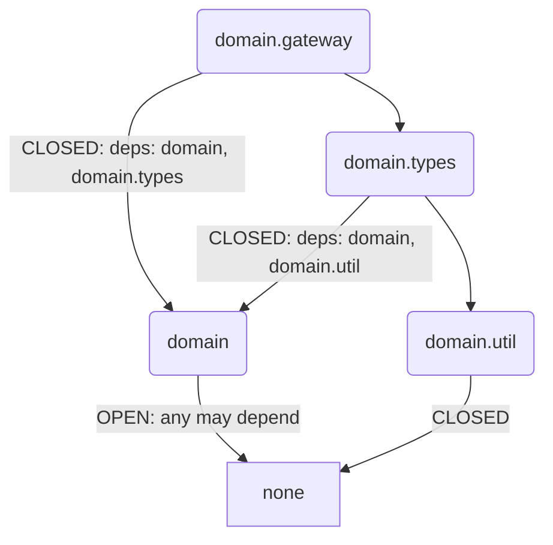

# Soda — DDD Scaffold

基于 yudao-cloud 业务功能改造的 DDD 脚手架项目。


## Module structure (Spring Modulith)

模块依赖通过 `@ApplicationModule(type = OPEN, allowedDependencies = …)` 严格白名单控制。
所有模块均设为 `type = OPEN`，允许被任何模块引用。无依赖的模块保持 `allowedDependencies = {}`，
有依赖的模块在 `allowedDependencies` 中显式声明。未声明的跨模块引用在测试阶段被拒绝。


```mermaid
graph TD
    domain(domain) -->|OPEN: any may depend| none
    util(domain.util) -->|CLOSED| none
    types(domain.types) -->|CLOSED: deps: domain, domain.util| domain
    types --> util
    gateway(domain.gateway) -->|CLOSED: deps: domain, domain.types| domain
    gateway --> types
```

 | Module | Type | Package | Allowed dependencies |
 |---|---|---|---|
 |`domain`|`OPEN`|`com.soda.component.domain`|(none)|
 |`domain.util`|`CLOSED`|`com.soda.component.domain.util`|(none)|
 |`domain.types`|`CLOSED`|`com.soda.component.domain.types`|`domain`, `domain.util`|
 |`domain.gateway`|`CLOSED`|`com.soda.component.domain.gateway`|`domain`, `domain.types`|

### Component starter dependency chain

分层 starter 按 DDD 架构层（api → domain → app → adapter 家族）+ 基础设施 + 读服务 + 启动入口切割。每个 starter 通过 `allowedDependencies` 强制依赖方向——下层模块不允许反向引用上层。业务模块只需按需引入对应层。

```mermaid
graph TD
    start(start) -->|allowedDeps: (none)| infrastructure
    web(web) -->|allowedDeps: api| api
    job(job) -->|allowedDeps: api| api
    consumer(consumer) -->|allowedDeps: api| api
    application(application) -->|allowedDeps: domain, api| domain
    application --> api
    infrastructure(infrastructure) -->|allowedDeps: domain| domain
    queryServer(query-server) -->|allowedDeps: api, infrastructure| api
    queryServer --> infrastructure
    domain(domain) -->|allowedDeps: (none)|
    api(api) -->|allowedDeps: (none)|
```

 | Module | Type | Package | Role | Allowed dependencies |
 |---|---|---|---|---|
 |`api`|`OPEN`|`com.soda.component.api`|共享 DTO/Command/Query 基类|(none)|
 |`domain`|`OPEN`|`com.soda.component.domain`|DDD 基类型（Entity/Aggregate/Identifier）|(none)|
 |`application`|`CLOSED`|`com.soda.component.application`|ApplicationService 基类 + CommandExecutor|`domain`, `api`|
 |`web`|`CLOSED`|`com.soda.component.web`|web 入站通道基类：Result 信封、错误结构、校验注解|`api`|
|`job`|`CLOSED`|`com.soda.component.job`|定时任务基类：JobContext|`api`|
|`consumer`|`CLOSED`|`com.soda.component.consumer`|消息消费者基类（空占位，待 MQ 集成，见 ADR-0019）|`api`|
 |`infrastructure`|`CLOSED`|`com.soda.component.infrastructure`|Repository/持久化骨架|`domain`|
 |`query-server`|`CLOSED`|`com.soda.component.queryserver`|读服务（混装）基类|`api`, `infrastructure`|
 |`start`|`CLOSED`|`com.soda.component.start`|写侧启动入口基类及配置|(none)（组件模块仅 testRuntimeOnly，见 start-starter ModulithTest）|

业务模块（如 `soda-user-xxx`）在各自的 build.gradle 中按需引入这些 starter，替代手写原生的 Spring 依赖：

| 业务模块 | 引入的 starter |
|---|---|
|`soda-user-api`|`soda-component-api-starter`|
|`soda-user-domain`|`soda-component-domain-starter` + `soda-component-domain-types`|
|`soda-user-adapter`|`soda-component-adapter-starter-web` + `soda-component-adapter-starter-job` + `soda-component-adapter-starter-consumer`|
|`soda-user-infrastructure`|`soda-component-domain-starter` + `soda-component-infrastructure-starter`|
|`soda-user-application`|`soda-component-api-starter` + `soda-component-application-starter`|
|`soda-user-start`|`soda-component-start-starter`（adapter/infrastructure 经 runtimeOnly 的 user-adapter/user-infrastructure 传递）|

## Modulith 治理规则

### 白名单原则
模块依赖通过 `@ApplicationModule(allowedDependencies = …)` 严格白名单控制。
按 `type` 分两类：

| 模块角色 | `type` | 校验行为 | `allowedDependencies` |
|---|---|---|---|
| 根模块（无依赖） | `OPEN` | 允许被任何模块引用，自身依赖不校验 | `{}`（默认） |
| 有依赖的业务层模块 | `CLOSED` | 依赖方向被 ModulithTest 强制校验，import 超出 `allowedDependencies` 的模块即失败 | 显式声明白名单 |

未声明的跨模块引用在编译时不会被阻止，但会被 `ModulithTest.verify()` 在测试阶段捕获并拒绝（针对 `CLOSED` 模块）。

### ModulithTest 强制
每个 Gradle 子项目（soda-components、soda-supports、将来每个 soda-xxx 业务模块）**必须**有一个 Modulith 一致性验证测试。

模板（放在项目的 `src/test/java/<base-package>/ModulithTest.java` 中）：

```java
import org.junit.jupiter.api.Test;
import org.springframework.modulith.core.ApplicationModules;

class ModulithTest {

    @Test
    void verifyModuleStructure() {
        ApplicationModules.of("com.soda.xxx").verify();
    }
}
```

### 新增模块步骤
1. 在根包添加 `package-info.java`，标注 `@ApplicationModule(allowedDependencies = {…})`
   - 无依赖的根模块 → `type = OPEN`, `allowedDependencies = {}`
   - 有依赖的业务层模块 → `type = CLOSED`, `allowedDependencies` 中声明所需模块的完整逻辑名（如 `domain.util`，非 `util`）
2. 在所属项目的 `ModulithTest` 注释表格中新增一行（文档用途，测试自动扫描）
3. 运行 `ModulithTest.verifyModuleStructure()` 确认无违反
## Language

### User
用户身份聚合根。持有一组 AuthAccount 子实体。

属性修改通过意图命名的 domain 方法表达，不暴露 setXXX：
- `changeUsername(Username)` — 修改账号
- `changeNickname(Nickname)` — 修改昵称
- `changeMobile(Mobile)` — 修改手机号
- `changeEmail(Email)` — 修改邮箱
- `changeSex(Sex)` — 修改性别
- `changeAvatar(Avatar)` — 修改头像
- `changePassword(SecretValue, SecretValue, PasswordHasher)` — 修改密码：校验原密码后重哈希（原密码比对为域守卫，不匹配抛 IAE，见 ADR-0027；委托到 PasswordAuthAccount；密码账户为构造期必填字段，无查找）
- ~~`requestChangeMobileCode(Mobile, RandomStringGenerator)` / `requestChangeEmailCode(Email, RandomStringGenerator)`~~ — 已删除（2026-08-12，见 ADR-0021）：发码用例迁至 `VerificationService.requestCode`（2026-08-16 回归 `UserAuthService`，见 ADR-0026）
- `disable()` — 禁用用户。E→D 发 UserStateChangedEvent；已是 D 则 no-op；R → IAE（吸收态，见 ADR-0017）
- `enable()` — 启用用户。D→E 发 UserStateChangedEvent；已是 E 则 no-op；R → IAE（吸收态，见 ADR-0017）
- `deregister()` — 注销用户（终态迁移）。D→R 严格迁移（前置必须 D），发 UserDeregisteredEvent；R 为吸收态，此后无任何操作。键释放（三键置空 + 归档审计）由基础设施层表示决策负责，领域不感知（见 ADR-0023）

_Avoid_: 用户管理、系统用户、setXXX、changeStatus、删除（作为领域动词）、remove、物理删除
### Username
用户账号。4-30 位字母数字。全局唯一（DB 唯一索引 + `existsByUsername` 双重保证）。
`REMOVED`：注销终态默认值（`Username.REMOVED` = "removed"，见 ADR-0023）——R 行键释放后领域恢复的占位值，只存在于领域内存**从不落库**（DB 中 R 行 username 为 NULL）；"removed" 仍是可注册用户名。
_Avoid_: 账号、账号名、把 REMOVED 当作真实登录名

### Nickname
用户昵称。最长 30 字符，禁止空白字符。
_Avoid_: 名称、显示名

### Mobile
手机号（定义在 `domain.types`）。格式校验 + 归一化。是 SmsAuthAccountId 的派生源。

### Sex
性别枚举（`com.soda.component.domain.types.Sex`，位于 soda-components —— 通用共享枚举，供 web 层 `@EnumName` 引用而不越模块边界）。取值：`M`（Male）、`F`（Female）。

### Avatar
头像 URL。URL 格式校验。

### UserState
用户状态枚举。取值：`E`（Enabled）、`D`（Disabled）、`R`（Removed / 注销，吸收态终态）。
实现 `StateEnumType`（框架状态机枚举契约）：终态以常量子类覆写 `terminal()` 标记（仅 `R` 覆写返回 true），`terminal()` 供基础设施兜底守卫消费——终态行不可写按 terminal 泛化，新增终态只需枚举成员标记（ADR-0023）。实体侧状态机契约见 `Stateful` 术语。
状态跃迁通过 User 的方法 `disable()` / `enable()` / `deregister()` 表达，不暴露泛化的 changeState。
- `disable()`: state=E → 切换为 D, 触发 `UserStateChangedEvent`; 已是 D → no-op, 不发事件; R → IAE（吸收态，见 ADR-0017）
- `enable()`: state=D → 切换为 E, 触发 `UserStateChangedEvent`; 已是 E → no-op, 不发事件; R → IAE（吸收态，见 ADR-0017）
- `deregister()`: state=D → 切换为 R（严格 transition，前置必须 D），触发 `UserDeregisteredEvent`; R 为终态，之后无任何操作可执行；键释放由基础设施表示决策负责（ADR-0023）

_Avoid_: 删除作为领域动词、remove、把注销建模为独立 flag（终态是状态机一员，见 ADR-0017）

### Stateful
状态机对象契约接口（`com.soda.component.domain.Stateful`，框架契约，由 `Aggregate` 基类实现——聚合根能力：身份 + 状态机 + 领域事件源）——聚合声明「我是状态机对象」：`getState()` 暴露当前状态枚举（非空契约，状态机实体恒有状态），终态判定 `isTerminal()` 委托 `StateEnumType.terminal()`（单一事实源在状态枚举）。聚合的 `getState()` 由 `@Getter` 生成即满足（协变返回各自状态枚举，具体类型在具体聚合上可见），无需显式方法或泛型参数。普通实体（AuthAccount，仅布尔 active、无生命周期状态枚举）不实现本契约。消费：应用层 `AbstractAppService.requireNotTerminal` 统一守卫——终态（吸收态）实体禁止一切写，抛 IAE（业务拒绝）；持久层兜底为网关 save 内行终态判定裸抛 ISE（防御编程，异常类型 + 栈帧即语义，不携消息，绕过领域的写路径）。实现：`User`（R 终态）、`Verification`（U 终态）。仅承载跨状态机一致的「终态禁写」概念；初始态语义随状态机而异（恢复实体不在初始态）、禁用态是业务状态（User 专有 D，Verification 无此概念），均不进接口。
_Avoid_: 把「启用态/禁用态」当通用状态机概念（用例级状态前置如 CC 发码要求启用态，是业务断言不是框架契约）

### 键释放（Key Release）
注销终态（R）后 username/mobile/email 可被新注册占用（行业主流：微博/抖音/B站/Telegram；Google 邮箱为反例不回收）。领域语义 = 释放；持久化表示 = 三键置空（NULL）+ 原键快照入 `user_archive` 归档审计表，均同事务由基础设施层 `UserGateway.save` 的 D→R 分支实现，领域零感知（ADR-0023）。恢复时空 username 映射领域默认值 `Username.REMOVED`。
_Avoid_: 把键释放建模为领域行为（表示决策归基础设施，ADR-0017 §4 自由度）

### SocialType
社交平台类型枚举。取值：`GE`（Gitee）、`DT`（DingTalk）、`WENT`（WechatWork）、`WMP`（WechatMp）、`WOPN`（WechatOpen）、`WMIN`（WechatMini）、`ALIP`（AlipayMini）。

### AuthAccount
用户认证账号。密封基类，4 个子类对应 4 种认证方式。作为 User 聚合的子实体，由聚合根管理生命周期。`active` 使用 `Active` DP。
_Avoid_: 认证信息、登录方式、Account

### PasswordAuthAccount
密码认证账号。持有 `passwordHash`（`PasswordHash`，PHC 格式口令哈希）。提供 `verify(SecretValue, PasswordHasher)` 和 `changePassword(SecretValue, PasswordHasher)`。

### SmsAuthAccount
短信认证账号。不再持有验证码策略配置——码形是通道级规则，`VerificationCodePolicy` 仅作通道常量载体与 `Verification.create` 输入（2026-08-09 移除字段，见 ADR-0011/0018）；验证码状态由独立的 `Verification` 实体管理（见 ADR-0011）。

### EmailAuthAccount
邮箱认证账号。行为同 SmsAuthAccount。

### SocialAuthAccount
社交认证账号。纯标识映射，无密码验证。`socialType`/`openId` 编码在 AuthAccountId 中。

### AuthAccountId
账户标识符密封基类。序列化格式：`"{AuthAccountType短名}:{业务键}"`。4 个子类：

| 子类 | 格式示例 | 持有属性 |
|---|---|---|
| `PasswordAuthAccountId` | `"P:42"` | `UserId` |
| `SmsAuthAccountId` | `"S:13800138000"` | `Mobile` |
| `EmailAuthAccountId` | `"E:user@example.com"` | `Email` |
| `SocialAuthAccountId` | `"O:GE:open123"` | `SocialType` + `openId` |

反序列化通过密封基类的 `AuthAccountId.of(String)` 按前缀路由到对应子类。

### AuthAccountType
认证方式枚举。取值：`P`（Password）、`S`（Sms）、`E`（Email）、`O`（OAuth）。

### VerificationCodePolicy
验证码策略 DP（`com.soda.user.domain.types.VerificationCodePolicy`，位于 soda-user-domain）。封装 `codeLength`（`PositiveInt`）、`expiry`（`Duration`）和 `codeAlphabet`（`Alphabet`，字符集）——**嵌套 DP 值对象组合**（2026-08-09，见 ADR-0018；各嵌套 DP 在 JSON 中经自身 `@JsonValue`/creator 序列化为基本类型值）。提供 `DEFAULT_SMS`（6位/5分钟/`Alphabet.DIGITS`）和 `DEFAULT_EMAIL`（8位/30分钟/`Alphabet.UNAMBIGUOUS_ALPHANUMERIC`，去混淆字符集）。验证码的唯一策略类型：作为**通道常量载体**（码形是通道级规则，非账号数据——`SmsAuthAccount`/`EmailAuthAccount` 不持有 policy 字段，仅保留 `DEFAULT_POLICY` 常量作为预留契约，create 不再接受覆盖参数，2026-08-09 见 ADR-0011/0018）与 `Verification` create 构造**必传参数**（Verification 不做通道→策略映射），默认值由 `UserVerificationFactory` 按**场景方法**选择（UCC 专属策略：**纯数字、短时效、双通道统一**——6 位/5 分钟，不引用通道默认 `DEFAULT_SMS`/`DEFAULT_EMAIL`，2026-08-16 见 ADR-0026；决定码长、过期时间与字符集，效果物化进 `VerificationCode`，不落验证实体，见 ADR-0011、ADR-0018）。

### VerificationCode
验证码 DP（`com.soda.user.domain.types.VerificationCode`，位于 soda-user-domain）。封装 `code`、`expireAt`。`matches(RandomString)` 纯匹配；`expiredAt(Instant)` 纯过期判断——时钟由调用方注入，过期 / 匹配的组合校验由 `Verification` 聚合负责（jspecify 契约：参数默认非空，见 ADR-0015）。使用状态不落 DP——生命周期由 `Verification` 的 `state` 表达（单一事实源，见 ADR-0011）。

### Verification
独立聚合根（`com.soda.user.domain.Verification`，位于 soda-user-domain）。**单类**（2026-08-15 多态塌缩——撤销子类型层级与 `Verification<T extends Type>` 泛型参数化，见 ADR-0025；2026-08-12 由「Entity 非聚合根」重分类为聚合根——判据：URG（注册）场景发码时用户尚不存在（独立存在）、验证码生命周期与 User 不一致（5-30 分钟 vs 永久，URG 验证先于 user 诞生），见 ADR-0021）。
**双概念模型**（2026-08-16，见 ADR-0026）：只感知 `source`（`VerificationSource`——**不透明**，scene/subject 纯字符串，非空即足，零行为耦合）与 `recipient`（`VerificationRecipient`——多态密封，channel + 地址，**通道判别栖身于此**）。**主体裁定**：发送验证码的主体是**用户**（UCC/ULG/UPR；URG 无用户例外）——Verification 是协助方聚合（码生命周期载体），「UserVerification」是用例概念（非类，由应用服务编排实现，见 ADR-0026）。
状态机：`I`(Initialized) → `P`(Pending) → `V`(Verified) → `U`(Used)。过期是派生判断（基于 `code().expireAt()`，不落状态）。
策略不落实体——`policy` 为 create **必传参数**（Verification 不做通道→策略映射，策略决策属调用方场景），默认值由 `UserVerificationFactory` 按**场景方法**选择（UCC 专属：纯数字、短时效、双通道统一），效果物化进 `code`，不作为属性持久化。
行为：`verify(Instant at, RandomString)`（时钟注入）、`use()`、`isInitialized()`、`isPending()`、`isVerified()`、`isExpiredAt(at)`；`markSent()`（`I` → `P`——sender 分派由投递侧监听器按 **recipient 类型**匹配 `SmsSender`/`EmailSender`，发送成功才调用、失败不调）；`verify` 前置：待验证状态 → 未过期 → 码匹配（业务前置，带消息 IAE）；构造器非空参数用 `ValidateUtils` 校验（与 DP 一致，见 ADR-0015）。
投递时机：创建工厂注册 `VerificationCreatedEvent`，ApplicationService 持久化后发布，投递侧监听器在事务提交后（AFTER_COMMIT）按 recipient 类型匹配 sender（`SmsRecipient`→`SmsSender`、`EmailRecipient`→`EmailSender`——UCC 场景 recipient 是换绑的新联系方式、subject 是用户；URG 场景 subject 即 recipient 值——ULG/UPR subject 为 userId（端点反查），见 ADR-0026）执行投递并落库 P——DB 事务不跨外部投递通道持有；sender 契约保证投递成功才返回（监听器无重试），`P` 仅在其返回后落（「PENDING 蕴含已送达」不变量）。
_Avoid_: `verifyXxx` 作为发起验证码的动词（与 `Verification.verify` 的校验语义碰撞；发起动词是 `UserAuthService.requestChangeMobileCode`/`requestChangeEmailCode`，2026-08-16 见 ADR-0026）；在 Verification 内解析 source 语义（scene/subject 对聚合不透明——场景语义是调用方词汇，见 ADR-0026）
`recipient` 保持类型化多态 DP（`SmsRecipient`/`EmailRecipient`，构造边界校验）；`source` 纯字符串（scene 助记码 + subject 裸键，见 `VerificationSource` 词条）；`AuthenticatorVerification` 前瞻届时真实行为差异出现再重新密封（YAGNI，见 ADR-0025）。
User 的 `changeMobile(Verification)` / `changeEmail(Verification)` 接收验证聚合作为参数，验证通过后执行领域行为（守卫：`source.subject()` 与 userId 裸键串相等 → scene 为 UCC → VERIFIED → 目标不同——source 匹配守卫保留为防御纵深，见 ADR-0026）。
Verification 不被 User 聚合修改，**不感知 source 语义**（非空即足；不引用 User 聚合/UserId——source 纯字符串、recipient 包 component 层 `Mobile`/`Email`，零用户概念依赖，见 ADR-0026）。消费按 **source** 键控反查（`findLatestBySourceAndStateIn`——latest + source + stateIn 三维齐备；消费命令不含 target，换绑的新联系方式隐含在验证记录中，按 source 加载即主体匹配守卫）+ source 匹配守卫在 `User.changeXxx` 保留为防御纵深。**唯一性不变量**：同一 source 至多一条活跃验证（终态不参与唯一，见「活跃验证」词条），由基础设施 `active_key` 列 + `uk_active_key` 唯一索引硬保证（见 ADR-0026）。创建经 `UserAuthService.requestChangeMobileCode`/`requestChangeEmailCode`（2026-08-12 曾迁至 `VerificationService.requestCode`，2026-08-16 回归 User 侧——主体为 User 的裁定，见 ADR-0026）。

### VerificationChannel
验证通道枚举（`com.soda.user.domain.types.VerificationChannel`，位于 soda-user-domain）。取值：`S`（SMS，短信）、`E`（Email，邮箱）。**普通枚举，不挂 Class 引用**（映射归基础设施，见 ADR-0016）。角色（2026-08-16，见 ADR-0026）：① `RequestChangeMobileCodeCommand`/`RequestChangeEmailCodeCommand` 之外的预认证命令输入（ULG/UPR/URG 未来票）；② `VerificationRecipient` 判别属性（持久化 channel 独立列 + target 裸值，2026-08-16 修订）。码形策略按**场景**选择（`UserVerificationFactory` 按场景方法——UCC 专属纯数字/短时效、双通道统一，非按通道默认，见 ADR-0026）。**channel 只在 VerificationRecipient**——subject 不携带通道语义（判别源从 subject 前缀迁至 recipient；持久化 channel + target 两列，2026-08-16 修订，见 ADR-0026 注记）。
_Avoid_: 在业务逻辑中按 channel 判断分支（用 recipient 模式匹配）；给枚举挂 Class 引用（映射归基础设施，见 ADR-0016）

### CredentialChangeDomainService
领域服务（`com.soda.user.domain.service.CredentialChangeDomainService`，`@Service` 容器管理），无字段无 gateway 依赖。仅承载跨聚合编排（同时更改 User 与验证聚合）：
- `change(User, Verification, RandomString)` — verify → 换绑（**recipient 类型分派**：`SmsRecipient`→`user.changeMobile`、`EmailRecipient`→`user.changeEmail`——换绑目标由验证投递端点决定，2026-08-16 会话修订，原 changeMobile/changeEmail 两方法统一）→ use
验证码发起（UCC 前置：target ≠ 当前值、目标全局唯一、无活跃验证（`existsBySource`，2026-08-16 取代 `existsBySubjectAndScene`，见 ADR-0026）——后两者属跨实例查询，由 AppService 拦截）由 `UserAuthService.requestChangeMobileCode`/`requestChangeEmailCode` 编排（应用层前置 + `UserVerificationFactory` 构造 INITIALIZED 验证实体（scene=UCC，2026-08-16 见 ADR-0026）+ 注册 `VerificationCreatedEvent`，2026-08-12 曾迁至 `VerificationService.requestCode`、2026-08-16 回归 User 侧，见 ADR-0021/0026）；物理发送由投递侧监听器在事务提交后执行（见 ADR-0011）。
持久化（保存顺序：先 user 后 verification）由 ApplicationService 保证；失败路径（错码/过期）不落库——实体无变更（无 attempts 可累计）。消费验证按 **source** 键控加载（`findLatestBySourceAndStateIn`）+ source 匹配守卫保留为防御纵深（subject 裸键串比较，见 ADR-0026）。

### UserVerificationScene
验证场景枚举（`com.soda.user.domain.types.UserVerificationScene`，位于 soda-user-domain；2026-08-16 由 `VerificationScene` 更名，见 ADR-0026）。**调用方词汇**——区分不同业务用途、防止多调用方冲突；Verification 不感知（`VerificationSource.scene` 是纯字符串，场景语义只在此枚举与工厂/AppService 消费）。
取值：`UCC`（User Credential Change，换绑联系方式/凭证变更）、`UPR`（User Password Reset，找回密码）、`ULG`（User Login，登录验证）、`URG`（User Register，注册验证）——**扁平助记码**（2026-08-15，ADR-0005 修订，见 ADR-0025）：领域前缀助记码满足 1-4 字符规则（SocialType 先例），`code()` 返回助记码串（= `VerificationSource.scene` 值）；跨领域共享时以前缀隔离（未来 sys_user 场景用 `S*`，yudao `SmsSceneEnum` MEMBER_*/ADMIN_* 同构）。
手机/邮箱换绑共用 `UCC`，通道差异由 `VerificationRecipient` 多态区分。

### VerificationState
验证状态枚举（`com.soda.user.domain.types.VerificationState`，位于 soda-user-domain）。取值：`I`（Initialized，已创建待投递——发送由 `VerificationCreatedEvent` 在事务提交后驱动）、`P`（Pending，待验证）、`V`（Verified，已验证）、`U`（Used，已使用，终态，`terminal()`，见 ADR-0023）。过期是派生判断，不落状态（见 ADR-0011）。`V` 在原子消费流（verify→change→use 单事务）中**永不落库**——它是「码已核对」事实的唯一载体（`use()` 前置、changeMobile 守卫 VERIFIED 承重），并为未来拆分流（verify 一步 / confirm 一步）预留（见 ADR-0025）。

_Avoid_: 将验证码（临时状态）存入 SmsAuthAccount 或 User 聚合


### 活跃验证（active verification）
验证存在性谓词的领域语义：`state ∈ {I, P}` 且未过期（`expireAt > now`）。**唯一性不变量**：同一 `source`（scene:subject）至多一条活跃验证——subject 即该场景的身份（**UCC/ULG/UPR=用户**——防同主体多通道并发：UCC 防对无限不同 recipient 发码、ULG/UPR 防手机+邮箱双码并存；URG=投递端点，防同端点重复）。**终态不参与唯一**（与 User 同原则；机制不同：User R 键置 NULL，Verification V/U 清 `active_key`）。由基础设施 `active_key` 列 + `uk_active_key` 唯一索引硬保证（键 = `source.compositeKey()`；I/P 且未过期占槽，V/U 迁移清空、过期 I/P 行惰性 DELETE 释放，见 ADR-0026；2026-08-16 修订：active_key 由 convertor 恒设，V/U 清空收敛进 gateway.save）。
_Avoid_: 把「活跃」当作状态（无 E 态——过期是派生判断，见 ADR-0011）；在 `existsBy*` 契约名中拼「活跃/过期」措辞（契约只声明键存在性，活跃判定是基础设施实现细节，见 ADR-0025）


### VerificationSource
请求源 DP（`com.soda.user.domain.types.VerificationSource`，位于 soda-user-domain；2026-08-16，见 ADR-0026）。`{scene: String, subject: String}`——scene = 扁平助记码（`UCC`/`UPR`/`ULG`/`URG`，来自 `UserVerificationScene.code()`）；subject = **裸业务键**（无类型前缀：userId 数字串 / 手机号 / 邮箱）。两属性均**非空**（Verification 对 source 的唯一要求——不透明，零行为耦合）。`compositeKey()` = `scene + ":" + subject`——`active_key` 单一事实源（取代 0025 的 infra `compose` 单点函数；复合键推导非序列化——串从不解析回 DP，单向派生的槽位唯一键）。
支撑不变量：**同一 scene 内 subject 语义类型恒定**——subject 即唯一索引的**槽位占用者**：UCC/ULG/UPR = userId 裸键串（UCC 会话注入、ULG/UPR 端点反查推导）、URG = 端点值串（无用户）——裸键安全的前提（跨场景由 scene 消歧、同场景内类型由场景语义固定）。
端点承载（ADR-0034）：当场景的 subject 即投递端点本身（URG），该值以**盲索引**形态进入槽位键——等值判定可用而原文不可还原（带随机 IV 的密文会使槽位唯一性防重与消费反查双双失效）。
_Avoid_: 给 subject 加类型前缀（通道语义归 `VerificationRecipient`，见 ADR-0026）；在 Verification 内解析 scene/subject 语义

### VerificationRecipient
投递端点多态 DP（`com.soda.user.domain.types.VerificationRecipient`，位于 soda-user-domain；2026-08-16，见 ADR-0026）。密封层级：`SmsRecipient(Mobile)` / `EmailRecipient(Email)`——**channel 只在 VerificationRecipient**。**泛型多态**（修订四/六，2026-08-16 起边界为 `T extends StringLiteralType`，见 ADR-0028）：类型参数 `T extends StringLiteralType`（组件层字符串字面量契约，`String value()`，`@JsonValue` 继承自家族接口；与 `EnumType` 平行——枚举是封闭常量集，不包装字面量），`target()` 返回类型化地址 DP（`SmsRecipient.target()` = `Mobile`、`EmailRecipient.target()` = `Email`——record 组件即 target，隐式访问器满足接口方法，投递侧直接取类型化地址，基础设施直接 `target().value()` 落裸串免判别）；多属性输出：`channel()`（派生 `S`/`E`，构造无冗余参数）+ `target()`，JSON 对象形式 `{"channel":"S","target":"13800138000"}`（`channel()` 根访问器 `@JsonProperty`、组件 target 经地址 DP `@JsonValue` 序列化为裸串），反序列化经双参 `@JsonCreator`——**无规范字符串/无前缀路由**（`value()`/`of(String)` 删除，修订三/四）；持久化拆 `channel` + `target` 两列（2026-08-16 修订：替代 recipient 自描述单列），restore 经 `of(String, String)` 双参工厂按枚举分派（channel 枚举解析在工厂内单点，修订五）。消费：投递侧监听器按 recipient 类型匹配 sender（`SmsRecipient`→`SmsSender`、`EmailRecipient`→`EmailSender`）；码形策略经 `channel()` 选择（见 `VerificationCodePolicy`）。


### UserAuthService
用户认证/凭证用例的 ApplicationService（接口 `com.soda.user.api.UserAuthService`；实现 `soda-user-application`）。**UCC 发码与消费完整归位**（2026-08-16，见 ADR-0026——`VerificationService` 作废，0021 曾迁出的发码用例回归 User 侧）：
- `requestChangeMobileCode(RequestChangeMobileCodeCommand{userId, newMobile})` / `requestChangeEmailCode(RequestChangeEmailCodeCommand{userId, newEmail})` — **UCC 发码唯一入口**（userId 由 adapter 从认证会话解析注入、**必填**；scene/channel 由方法隐式——客户端请求体零主体/场景概念）：前置（加载用户启用态 + 非终态 + target ≠ 当前值 + 目标全局唯一）→ `UserVerificationFactory.newCredentialChangeVerification` 构造 INITIALIZED 验证实体（**先构造**——source 取自已构造实体，零并行推导）→ `existsBySource` 无活跃验证 → save（convertor 设 `active_key` = `source.serialize()`；**惰性 DELETE 过期 I/P 行收敛在 gateway 实现内**、同事务腾槽——基础设施实现细节，非领域契约，见 ADR-0026）→ 发布 `VerificationCreatedEvent`（AFTER_COMMIT 投递）；并发撞 `uk_active_key` → `DataIntegrityViolationException` **原样上抛**（预检 + DB 兜底，无翻译，见 ADR-0026）
- `changePassword` / `changeMobile` / `changeEmail` — 消费验证码（verify → change → use，经 `CredentialChangeDomainService` 编排，同事务双 save）
- ULG/UPR/URG（未来票）：预认证/无用户场景，集合级端点（`POST /api/users:requestLoginCode`、`:requestPasswordResetCode`、`:requestRegisterCode`，body {channel, contact}——AIP-136 集合级自定义方法，见 ADR-0026），各自用户侧/注册服务承载
_Avoid_: 把物理发送写进服务编排（发送是 AFTER_COMMIT 投递职责，见 ADR-0011）；在 api 命令中携带 scene/channel（方法即场景，客户端不可伪造）


### Alphabet
字符集 DP（`com.soda.component.domain.types.Alphabet`，位于 soda-components）。包装任意字符集字符串（开集，非枚举）——`RandomStringGenerator` 以它为输入决定输出字符。不变量：非空、字符唯一（字符集语义是集合，重复字符=隐式加权，几乎必是 bug）、size ≥ 2（熵下限）。提供 `size()` 与严格索引 `charAt(int)`（0 ≤ index < size，越界 IAE）——DP 只做纯索引映射，随机源由生成器负责（`SecureRandom.nextInt(size)`，拒绝采样无偏，见 ADR-0018）。常量：`DIGITS`（0-9）、`UNAMBIGUOUS_ALPHANUMERIC`（数字+大写字母，去除易混淆字符 0/1/I/O）。序列化为裸字符串。
_Avoid_: 策略（与 `VerificationCodePolicy` 冲突）、charset（与 `java.nio.charset.Charset` 混淆）、把字符池散落进生成器实现

### Percentage
百分比 DP（`com.soda.component.domain.types.Percentage`）。不可变、自校验，字面值语义（12.34 表示 12.34%）。`extends DecimalLiteralType`（小数字面量基类，契约与缓存不变量同类，见 ADR-0031；`@JsonValue` 继承自 `StringLiteralType`，见 ADR-0028）。取值范围 `[0, 100]`（`validate` 钩子），最多 2 位小数。提供 `toFraction()`（转小数 0.1234）和 `toDisplayString()`（输出 "12.34%"）。


### Fen
分 DP（`com.soda.component.domain.types.Fen`）。通用金额值对象，以分记，int 存储（1 元 = 100 分）。值域覆盖整个 int 范围（约 ±2147 万元），负值合法，用于退款、冲正等负向金额；超出范围请用 `WanYuan`。提供 `fromYuan(BigDecimal[, RoundingMode])`（元转分）、`toYuan()`（分转元，精确）、`toDisplayString()`（输出 "15.00元"）。

### WanYuan
人民币万元 DP（`com.soda.component.domain.types.WanYuan`，位于 soda-components）。`BigDecimal` 后端，规范值为 `String`（`toPlainString()`，`@JsonValue`，`equals`/`hashCode` 依据），BigDecimal 为派生缓存。精度到百元（最多 2 位小数），可为负。`extends DecimalLiteralType`（小数字面量基类，契约与缓存不变量同类，见 ADR-0031；`@JsonValue` 继承自 `StringLiteralType`，见 ADR-0028）。提供 `fromYuan(BigDecimal[, RoundingMode])`、`toYuan()`、`toDisplayString()`（输出 "111.11万元"）。超出 `Fen` 值域（约 ±2147 万元）的金额用本 DP。
_Avoid_: 元（单位混乱，用 `Fen`/`WanYuan` 明示单位）

### EpochMilli
绝对时间点 DP（`com.soda.component.domain.types.EpochMilli`，位于 soda-components）。`long value`（epoch 毫秒，规范值，`@JsonValue` 继承自 `LongLiteralType`，见 ADR-0028）+ 派生 `Instant instant()`（`Instant.ofEpochMilli` 毫秒精度互逆，亚毫秒截断——毫秒单位契约）。单位毫秒（主流 `System.currentTimeMillis`/JS `Date.now`/Go `UnixMilli`、保亚秒精度），覆盖 Jackson 3 裸 `Instant` 的 ISO-8601 字符串默认（见 ADR-0031）。当前契约就位、暂无生产消费方（现有裸 `Instant` 迁移另开一轮）；用于领域绝对时间字段（事件 `occurredAt`、`expireAt` 等）；审计列属基础设施、保持裸 `Instant`。
_Avoid_: Timestamp（JDBC 类型歧义）、裸 `Instant` 作领域字段（线上格式不受 DP 边界保护、Jackson 默认 ISO 串）


### SoftwareVersion
软件版本号 DP（`com.soda.component.domain.types.SoftwareVersion`，位于 soda-components）。三段式纯数字（major.minor.patch），每段 0-999，规范形式带小写 `v` 前缀（如 `v2.1.3`）。前导 0 归一化：`v2.001.003` 与 `v2.1.3` 等价；支持逐段数值比较与 `nextPatch`/`nextMinor`/`nextMajor` 步进（段位到 999 抛错，不进位）。
_Avoid_: Version（乐观锁版本号，单 int 计数器）、SemVer（本 DP 无 pre-release/build 后缀）、版本号

### Adapter 家族（adapter starter family）
`com.soda.component` 下按入站通道拆分的可选基类模块族（见 ADR-0019）：`web`（Result 信封、错误结构、校验注解）、`job`（JobContext）、`consumer`（占位）。每通道一个 Gradle 子模块 `soda-component-adapter-starter-{web,job,consumer}`；包名不含 "adapter"——"adapter" 仅是构建级家族标签，Modulith 模块名即通道名。家族依赖 `{api}`，与基础设施（`{domain}`）并列、不隶属，按需引入。
_Avoid_: 称 adapter 家族为"基础设施层"（依赖方向不同：家族 {api} vs 基础设施 {domain}）；与业务模块写侧 adapter 子模块（soda-user-adapter，见 Request/Response/WebAssembler）混为一谈

### Result
统一 API 操作结果信封。`{ code, msg, data, error }`。所有 REST Controller 的返回值必须用此类包裹。
定义在 `soda-component-adapter-starter-web` 的 `com.soda.component.web` 包。
错误响应时 `error` 字段包含 `ErrorInfo`（reason、domain、metadata），遵循 AIP-193。
_Avoid_: CommonResult、R 对象

### ErrorInfo
错误详情结构。包含 `reason`（UPPER_SNAKE_CASE 语义码）、`domain`（服务域）、`metadata`（上下文键值对）。
定义在 `soda-component-adapter-starter-web` 的 `com.soda.component.web` 包。
参考 ADR-0013。

### Command（API 层）
所有写操作命令的公共接口（marker + `validateOnly()` 默认方法——仅验证不执行的声明，暂无实现覆写，为后续待实现特性）。定义在 `soda-component-api-starter` 的 `com.soda.component.api.command` 包。

Command **暂不携带校验注解**（2026-08-02 决策，与 Request 校验职责分离）：HTTP 入口已由 Request 层 `@Valid` 校验保证，RPC 入口（Dubbo `validation="true"`）接线时再评估补注解。领域规则（如 `@Pattern` 中的正则约束）保留在 Value Object 中，不放在 Command 上。
_Avoid_: 与 Request 混用；在 Command 上放领域规则注解
### Request（Adapter 层）
HTTP 请求体专用类型。放在 `web/request/` 子包，携带 JSR 380 `@Valid` 校验注解。
不受领域层概念约束，只描述 HTTP 协议格式。
_Avoid_: 与 Command 混用

### Response（Adapter 层）
HTTP 响应体 `data` 段专用类型。放在 `web/response/` 子包。
只描述返回给前端的数据形状，不含 `Result` 信封。
_Avoid_: 与 DTO 混用

### WebAssembler
Adapter 层转换器，负责 `Request → Command`（入站）和 `DTO → Response`（出站）的双向转换。
支持依赖注入（`@Component`），可单独单元测试。
方法命名规则：同参数个数的方法名必须不同，使用 `to{Action}Command`（如 `toCreateCommand`、`toUpdateCommand`），避免重载歧义。出站用 `toResponse`（单体）/ `toResponseList`（集合）。
_Avoid_: 在 Request/Response 上定义静态转换方法；同一类中用 `toCommand`/`toResponse` 做多个重载

### SensitiveValue
敏感值父型：toString 恒为脱敏形式的敏感数据 DP（Mobile/Email 等）基类概念。
_Avoid_: 与 SecretValue 混淆、裸值进日志

### SecretValue
瞬态凭证载体（密码/API Key/Token）：永不序列化、引用级相等、toString 全遮蔽；与 SensitiveValue 构成防御栈两层。
_Avoid_: 当可序列化值对象、持久化

### Masked*
已脱敏存储形态家族（MaskedMobile/MaskedEmail/MaskedIdCard/MaskedBankCard/MaskedRealName）：展示场景落库的脱敏值，格式自校验，由原始值 DP 经 from() 派生。
_Avoid_: 与原始值 DP 混淆、对掩码值再次脱敏

### Ciphertext
可逆加密信封字面量（JWE compact：alg=dir + enc=A256GCM + kid）。类型擦除——不携带原始类型信息，解密由调用方显式提供目标字面量类型。无钥惰性、非攻击素材，无遮蔽义务。
_Avoid_: 从密文推断原文类型、把它当需脱敏的敏感值

### Digest
32 字节等值摘要字面量（hex 或标准 base64，url-safe 不接受）。高熵令牌查找（无钥快哈希）与低熵 PII 盲索引（keyed HMAC）共用的单向指纹——它是敏感原值的替代品，删除即丧失等值能力。
_Avoid_: 与 PasswordHash 混淆（PHC 口令串）、当作可还原凭证

### PasswordHash
口令哈希字面量（PHC 自描述格式：argon2/bcrypt/scrypt/pbkdf2 前缀白名单）。哈希族唯一 SensitiveValue 特例——toString 强制遮蔽，遮蔽保留至盐段之前。长度上限经 TypeConfigProvider.passwordHashMaxLength() 配置（默认 200）。
_Avoid_: 与 Digest 混淆、日志输出完整 PHC 串

### 盲索引（Blind Index）
低熵敏感字面量（手机号/邮箱）的等值查询指纹：归一化后以独立主钥做 keyed 摘要——确定性、不可还原，泄露面仅等值关系与频次。与密文列组成两列模式（ct 还原 + bidx 等值查询）。
_Avoid_: 用明文列建唯一索引、把盲索引当还原依据、对低熵值做无钥哈希（可被秒爆）