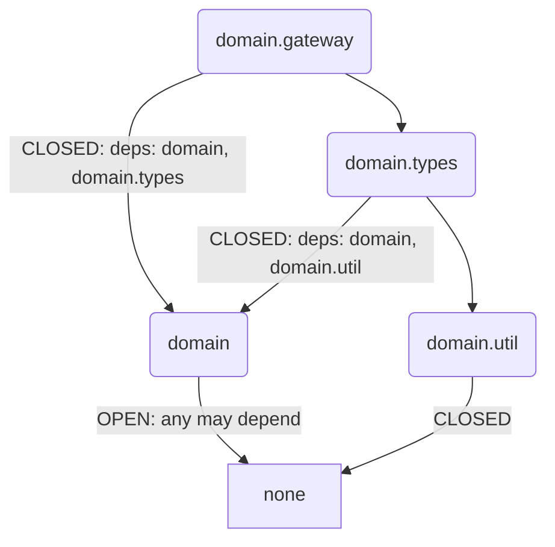

# Soda — DDD Scaffold

基于 yudao-cloud 业务功能改造的 DDD 脚手架项目。


## Module structure (Spring Modulith)

模块依赖通过 `@ApplicationModule(type = OPEN, allowedDependencies = …)` 严格白名单控制。
所有模块均设为 `type = OPEN`，允许被任何模块引用。无依赖的模块保持 `allowedDependencies = {}`，
有依赖的模块在 `allowedDependencies` 中显式声明。未声明的跨模块引用在测试阶段被拒绝。


```mermaid
graph TD
    domain(domain) -->|OPEN: any may depend| none
    util(domain.util) -->|CLOSED| none
    types(domain.types) -->|CLOSED: deps: domain, domain.util| domain
    types --> util
    gateway(domain.gateway) -->|CLOSED: deps: domain, domain.types| domain
    gateway --> types
```

 | Module | Type | Package | Allowed dependencies |
 |---|---|---|---|
 |`domain`|`OPEN`|`com.soda.component.domain`|(none)|
 |`domain.util`|`CLOSED`|`com.soda.component.domain.util`|(none)|
 |`domain.types`|`CLOSED`|`com.soda.component.domain.types`|`domain`, `domain.util`|
 |`domain.gateway`|`CLOSED`|`com.soda.component.domain.gateway`|`domain`, `domain.types`|

### Component starter dependency chain

分层 starter 按 DDD 架构层（api → domain → app → adapter）+ 基础设施 + 读服务 + 启动入口切割。每个 starter 通过 `allowedDependencies` 强制依赖方向——下层模块不允许反向引用上层。业务模块只需按需引入对应层。

```mermaid
graph TD
    start(start) -->|allowedDeps: adapter, infrastructure| adapter
    start --> infrastructure
    adapter(adapter) -->|allowedDeps: api + application(classpath)| api
    application(application) -->|allowedDeps: domain, api| domain
    application --> api
    infrastructure(infrastructure) -->|allowedDeps: domain| domain
    queryServer(query-server) -->|allowedDeps: api, infrastructure| api
    queryServer --> infrastructure
    domain(domain) -->|allowedDeps: (none)|
    api(api) -->|allowedDeps: (none)|
```

 | Module | Type | Package | Role | Allowed dependencies |
 |---|---|---|---|---|
 |`api`|`OPEN`|`com.soda.component.api`|共享 DTO/Command/Query 基类|(none)|
 |`domain`|`OPEN`|`com.soda.component.domain`|DDD 基类型（Entity/Aggregate/Identifier）|(none)|
 |`application`|`CLOSED`|`com.soda.component.application`|ApplicationService 基类 + CommandExecutor|`domain`, `api`|
 |`adapter`|`CLOSED`|`com.soda.component.adapter`|Controller/Assembler 基类|`api` (application 只在 runtime classpath，ModulithTest 强制代码不得 import application)|
 |`infrastructure`|`CLOSED`|`com.soda.component.infrastructure`|Repository/持久化骨架|`domain`|
 |`query-server`|`CLOSED`|`com.soda.component.queryserver`|读服务（混装）基类|`api`, `infrastructure`|
 |`start`|`CLOSED`|`com.soda.component.start`|写侧启动入口基类及配置|`adapter`, `infrastructure`|

业务模块（如 `soda-user-xxx`）在各自的 build.gradle 中按需引入这些 starter，替代手写原生的 Spring 依赖：

| 业务模块 | 引入的 starter |
|---|---|
|`soda-user-api`|`soda-component-api-starter`|
|`soda-user-domain`|`soda-component-domain-starter` + `soda-component-domain-types`|
|`soda-user-adapter`|`soda-component-adapter-starter`|
|`soda-user-infrastructure`|`soda-component-domain-starter` + `soda-component-infrastructure-starter`|
|`soda-user-application`|`soda-component-api-starter` + `soda-component-application-starter`|
|`soda-user-start`|`soda-component-adapter-starter` + `soda-component-infrastructure-starter` + `soda-component-start-starter`|

## Modulith 治理规则

### 白名单原则
模块依赖通过 `@ApplicationModule(allowedDependencies = …)` 严格白名单控制。
按 `type` 分两类：

| 模块角色 | `type` | 校验行为 | `allowedDependencies` |
|---|---|---|---|
| 根模块（无依赖） | `OPEN` | 允许被任何模块引用，自身依赖不校验 | `{}`（默认） |
| 有依赖的业务层模块 | `CLOSED` | 依赖方向被 ModulithTest 强制校验，import 超出 `allowedDependencies` 的模块即失败 | 显式声明白名单 |

未声明的跨模块引用在编译时不会被阻止，但会被 `ModulithTest.verify()` 在测试阶段捕获并拒绝（针对 `CLOSED` 模块）。

### ModulithTest 强制
每个 Gradle 子项目（soda-components、soda-supports、将来每个 soda-xxx 业务模块）**必须**有一个 Modulith 一致性验证测试。

模板（放在项目的 `src/test/java/<base-package>/ModulithTest.java` 中）：

```java
import org.junit.jupiter.api.Test;
import org.springframework.modulith.core.ApplicationModules;

class ModulithTest {

    @Test
    void verifyModuleStructure() {
        ApplicationModules.of("com.soda.xxx").verify();
    }
}
```

### 新增模块步骤
1. 在根包添加 `package-info.java`，标注 `@ApplicationModule(allowedDependencies = {…})`
   - 无依赖的根模块 → `type = OPEN`, `allowedDependencies = {}`
   - 有依赖的业务层模块 → `type = CLOSED`, `allowedDependencies` 中声明所需模块的完整逻辑名（如 `domain.util`，非 `util`）
2. 在所属项目的 `ModulithTest` 注释表格中新增一行（文档用途，测试自动扫描）
3. 运行 `ModulithTest.verifyModuleStructure()` 确认无违反
## Language

### User
用户身份聚合根。持有一组 AuthAccount 子实体。

属性修改通过意图命名的 domain 方法表达，不暴露 setXXX：
- `changeUsername(Username)` — 修改账号
- `changeNickname(Nickname)` — 修改昵称
- `changeMobile(Mobile)` — 修改手机号
- `changeEmail(Email)` — 修改邮箱
- `changeSex(Sex)` — 修改性别
- `changeAvatar(Avatar)` — 修改头像
- `changePassword(RawCredential, CredentialHasher)` — 修改密码（委托到 PasswordAuthAccount；密码账户为构造期必填字段，无查找无守卫）
- `disable()` — 禁用用户。E→D 发 UserStateChangedEvent；已是 D 则 no-op
- `enable()` — 启用用户。D→E 发 UserStateChangedEvent；已是 E 则 no-op

_Avoid_: 用户管理、系统用户、setXXX、changeStatus
### Username
用户账号。4-30 位字母数字。全局唯一。
_Avoid_: 账号、账号名

### Nickname
用户昵称。最长 30 字符，禁止空白字符。
_Avoid_: 名称、显示名

### Mobile
手机号（定义在 `domain.types`）。格式校验 + 归一化。是 SmsAuthAccountId 的派生源。

### Sex
性别枚举（`com.soda.component.domain.types.Sex`，位于 soda-components —— 通用共享枚举，供 web 层 `@EnumName` 引用而不越模块边界）。取值：`M`（Male）、`F`（Female）。

### Avatar
头像 URL。URL 格式校验。

### UserState
用户状态枚举。取值：`E`（Enabled）、`D`（Disabled）。

状态跃迁通过 User 的方法 `disable()` / `enable()` 表达，不暴露泛化的 changeState。
- `disable()`: state=E → 切换为 D, 触发 `UserStateChangedEvent`; 已是 D → no-op, 不发事件
- `enable()`: state=D → 切换为 E, 触发 `UserStateChangedEvent`; 已是 E → no-op, 不发事件

### SocialType
社交平台类型枚举。取值：`GE`（Gitee）、`DT`（DingTalk）、`WENT`（WechatWork）、`WMP`（WechatMp）、`WOPN`（WechatOpen）、`WMIN`（WechatMini）、`ALIP`（AlipayMini）。

### AuthAccount
用户认证账号。密封基类，4 个子类对应 4 种认证方式。作为 User 聚合的子实体，由聚合根管理生命周期。`active` 使用 `Active` DP。
_Avoid_: 认证信息、登录方式、Account

### PasswordAuthAccount
密码认证账号。持有 `passwordHash`（`CredentialHash`）。提供 `verify(RawCredential, CredentialHasher)` 和 `changePassword(RawCredential, CredentialHasher)`。

### SmsAuthAccount
短信认证账号。持有 `VerificationCodePolicy`（验证码策略配置）。不再持有临时验证码——验证码状态由独立的 `Verification` 实体管理（见 ADR-0011）。

### EmailAuthAccount
邮箱认证账号。行为同 SmsAuthAccount。

### SocialAuthAccount
社交认证账号。纯标识映射，无密码验证。`socialType`/`openId` 编码在 AuthAccountId 中。

### AuthAccountId
账户标识符密封基类。序列化格式：`"{AuthAccountType短名}:{业务键}"`。4 个子类：

| 子类 | 格式示例 | 持有属性 |
|---|---|---|
| `PasswordAuthAccountId` | `"P:42"` | `UserId` |
| `SmsAuthAccountId` | `"S:13800138000"` | `Mobile` |
| `EmailAuthAccountId` | `"E:user@example.com"` | `Email` |
| `SocialAuthAccountId` | `"O:GE:open123"` | `SocialType` + `openId` |

反序列化通过密封基类的 `AuthAccountId.of(String)` 按前缀路由到对应子类。

### AuthAccountType
认证方式枚举。取值：`P`（Password）、`S`（Sms）、`E`（Email）、`O`（OAuth）。

### VerificationCodePolicy
验证码策略 DP（`com.soda.user.domain.types.VerificationCodePolicy`，位于 soda-user-domain）。封装 `codeLength` 和 `expiry`。提供 `DEFAULT_SMS`（6位/5分钟）和 `DEFAULT_EMAIL`（8位/30分钟）。验证码的唯一策略类型：作为认证方式的账号配置字段，并在创建 `Verification` 时作为 create 构造末位可空参数（缺省取子类静态 `DEFAULT_POLICY`——`SmsVerification.DEFAULT_POLICY`/`EmailVerification.DEFAULT_POLICY`；决定码长与过期时间，效果物化进 `VerificationCode`，不落验证实体，见 ADR-0011）。解析链：per-account 覆盖 → 子类静态 `DEFAULT_POLICY`。（ServiceLoader SPI 暂未实现）

### VerificationCode
验证码 DP（`com.soda.user.domain.types.VerificationCode`，位于 soda-user-domain）。封装 `code`、`expireAt`。`matches(RandomString)` 纯匹配；`expiredAt(Instant)` 纯过期判断——时钟由调用方注入，过期 / 匹配的组合校验由 `Verification` 聚合负责（jspecify 契约：参数默认非空，见 ADR-0015）。使用状态不落 DP——生命周期由 `Verification` 的 `status` 表达（单一事实源，见 ADR-0011）。

### Verification
独立验证实体（`com.soda.user.domain.Verification`，位于 soda-user-domain）。无子实体，按 Entity 分类（非聚合根）。密封类层次结构，与 `AuthAccount` 对称设计；`target` 类型参数化到基类（`Verification<T extends Type>`），子类仅保留 target 类型与 `@JsonTypeName` 差异。
状态机：`I`(Initialized) → `P`(Pending) → `V`(Verified) → `U`(Used)。过期是派生判断（基于 `code().expireAt()`，不落状态）。
策略不落实体——创建时以子类静态 `DEFAULT_POLICY` 为默认（`policy` 为 create 末位可空参数），决定码长与过期时间，效果物化进 `code`，不作为属性持久化。
行为：`verify(Instant at, RandomString)`（时钟注入）、`use()`、`isInitialized()`、`isPending()`、`isVerified()`、`isExpiredAt(at)`；子类 `send(SmsSender)` / `send(EmailSender)`（sender 参数注入，发送成功后 `I` → `P`，发送失败状态保持 `I`）；`verify` 前置：待验证状态 → 未过期 → 码匹配（业务前置，带消息 IAE）；构造器非空参数用 `ValidateUtils` 校验（与 DP 一致，见 ADR-0015）。
两种子类型：`SmsVerification`（target=Mobile）、`EmailVerification`（target=Email）。（AuthenticatorVerification 暂不实现）
User 的 `changeMobile(SmsVerification)` / `changeEmail(EmailVerification)` 接收对应子类型作为参数，验证通过后执行领域行为（守卫：userId 匹配 → scene 必须为 CC → VERIFIED → 目标不同）。
Verification 不被 User 聚合修改，通过 `userId` 引用 User。

### VerificationChannel
验证通道枚举（`com.soda.user.domain.types.VerificationChannel`，位于 soda-user-domain）。取值：`S`（SMS，短信）、`E`（Email，邮箱）。与 `Verification` 子类型一一对应，是验证方式的判别值——构成 JSON `channel` 属性与持久化判别列。是领域概念（对领域专家有意义），但**不用于代码逻辑分派**：行为分派一律走子类型模式匹配或子类方法。
_Avoid_: 在业务逻辑中按 channel 判断分支（用模式匹配拿具体子类）；给枚举挂 Class 引用（映射归基础设施，见 ADR-0016）

### CredentialChangeDomainService
领域服务（`com.soda.user.domain.service.CredentialChangeDomainService`，`@Service` 容器管理），无字段无 gateway 依赖。仅承载跨聚合编排（同时更改 User 与验证聚合）：
- `changeMobile(User, SmsVerification, RandomString)` / `changeEmail(User, EmailVerification, RandomString)` — verify → change → use
验证码发起（前置：target ≠ 当前值、全局唯一、无未过期 PENDING；生成码、构造 INITIALIZED 验证实体（scene=CC）、经聚合 `send(sender)` 发送后转 PENDING）只涉及单聚合创建，由 `UserAuthServiceImpl.verifyMobile`/`verifyEmail` 直接执行（AppService 内展开）。
持久化（保存顺序：先 user 后 verification）由 ApplicationService 保证；失败路径（错码/过期）不落库——实体无变更（无 attempts 可累计）。

### VerificationScene
验证场景枚举（`com.soda.user.domain.types.VerificationScene`，位于 soda-user-domain）。区分不同业务用途，防止多调用方冲突。
取值：`CC`（Credential Change，换绑联系方式/凭证变更）、`PR`（Password Reset，找回密码）、`LG`（Login，登录验证）、`RG`（Register，注册验证）。
手机/邮箱换绑共用 `CC`，通道差异由 Verification subtype（SmsVerification / EmailVerification）区分。

### VerificationStatus
验证状态枚举（`com.soda.user.domain.types.VerificationStatus`，位于 soda-user-domain）。取值：`I`（Initialized，已初始化未发送）、`P`（Pending，待验证）、`V`（Verified，已验证）、`U`（Used，已使用，终态）。过期是派生判断，不落状态（见 ADR-0011）。

_Avoid_: 将验证码（临时状态）存入 SmsAuthAccount 或 User 聚合


### Percentage
百分比 DP（`com.soda.component.domain.types.Percentage`）。不可变、自校验，字面值语义（12.34 表示 12.34%）。取值范围 `[0, 100]`，最多 2 位小数。提供 `toFraction()`（转小数 0.1234）和 `toDisplayString()`（输出 "12.34%"）。


### Fen
分 DP（`com.soda.component.domain.types.Fen`）。通用金额值对象，以分记，int 存储（1 元 = 100 分）。值域覆盖整个 int 范围（约 ±2147 万元），负值合法，用于退款、冲正等负向金额；超出范围请用 `WanYuan`。提供 `fromYuan(BigDecimal[, RoundingMode])`（元转分）、`toYuan()`（分转元，精确）、`toDisplayString()`（输出 "15.00元"）。


### Result
统一 API 操作结果信封。`{ code, msg, data, error }`。所有 REST Controller 的返回值必须用此类包裹。
定义在 `soda-component-adapter-starter` 的 `com.soda.component.web` 包。
错误响应时 `error` 字段包含 `ErrorInfo`（reason、domain、metadata），遵循 AIP-193。
_Avoid_: CommonResult、R 对象

### ErrorInfo
错误详情结构。包含 `reason`（UPPER_SNAKE_CASE 语义码）、`domain`（服务域）、`metadata`（上下文键值对）。
定义在 `soda-component-adapter-starter` 的 `com.soda.component.web` 包。
参考 ADR-0013。

### Command（API 层）
所有写操作命令的公共接口（marker + `validateOnly()` 默认方法——仅验证不执行的声明，暂无实现覆写，为后续待实现特性）。定义在 `soda-component-api-starter` 的 `com.soda.component.api.command` 包。

Command **暂不携带校验注解**（2026-08-02 决策，与 Request 校验职责分离）：HTTP 入口已由 Request 层 `@Valid` 校验保证，RPC 入口（Dubbo `validation="true"`）接线时再评估补注解。领域规则（如 `@Pattern` 中的正则约束）保留在 Value Object 中，不放在 Command 上。
_Avoid_: 与 Request 混用；在 Command 上放领域规则注解
### Request（Adapter 层）
HTTP 请求体专用类型。放在 `web/request/` 子包，携带 JSR 380 `@Valid` 校验注解。
不受领域层概念约束，只描述 HTTP 协议格式。
_Avoid_: 与 Command 混用

### Response（Adapter 层）
HTTP 响应体 `data` 段专用类型。放在 `web/response/` 子包。
只描述返回给前端的数据形状，不含 `Result` 信封。
_Avoid_: 与 DTO 混用

### WebAssembler
Adapter 层转换器，负责 `Request → Command`（入站）和 `DTO → Response`（出站）的双向转换。
支持依赖注入（`@Component`），可单独单元测试。
方法命名规则：同参数个数的方法名必须不同，使用 `to{Action}Command`（如 `toCreateCommand`、`toUpdateCommand`），避免重载歧义。出站用 `toResponse`（单体）/ `toResponseList`（集合）。
_Avoid_: 在 Request/Response 上定义静态转换方法；同一类中用 `toCommand`/`toResponse` 做多个重载